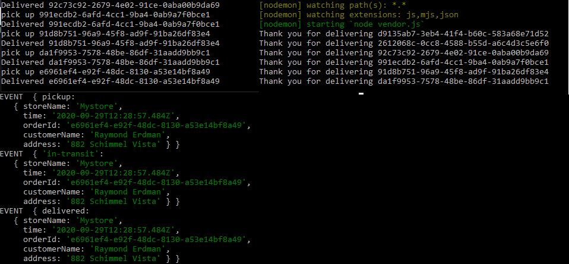
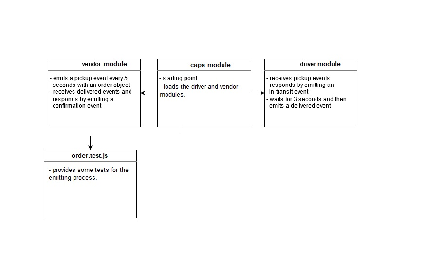

# CAPS

CAPS will simulate a delivery service where vendors (such a flower shops) will ship products using our delivery service and when our drivers deliver them, be notified that their customers received what they purchased.

### Prerequisites :

- npm install

- To start the app, in the terminal type `node caps.js`, this is how the output should look like:

- To work with the modules, in the terminal (3 different windows), You will need to start your servers up in the right order so that you can visually test things out: 

    - cd caps -> npm start
    - cd vendor -> npm start
    - cd driver -> npm start

When running, the vendor and driver consoles should show their own logs. Additionally, the CAPS server should be logging everything. Your console output should look something like this:

For testing :

- npm test

### UML 

