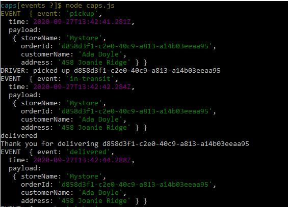
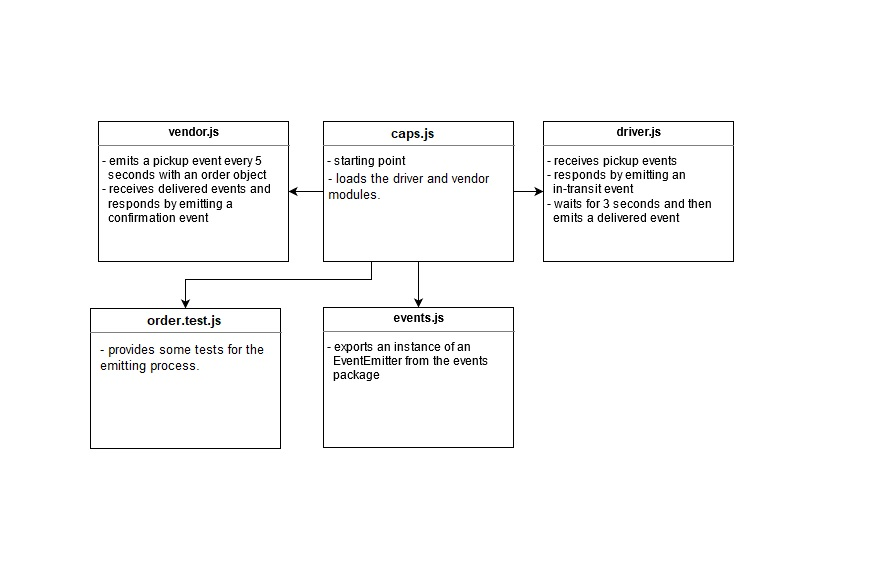

# CAPS

CAPS will simulate a delivery service where vendors (such a flower shops) will ship products using our delivery service and when our drivers deliver them, be notified that their customers received what they purchased.

### Prerequisites :

- npm install

- To start the app, in the terminal type `node caps.js`, this is how the output should look like:

For testing :

- npm test

### UML 

